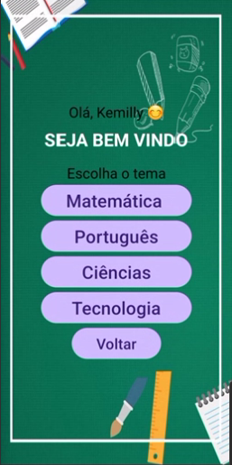
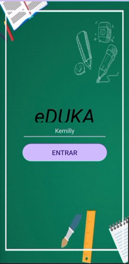
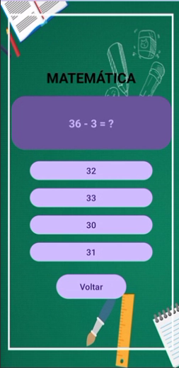
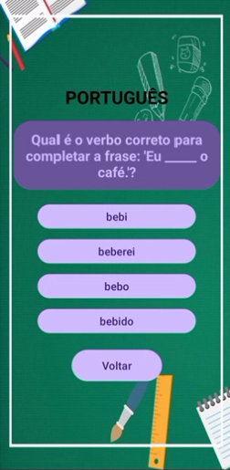
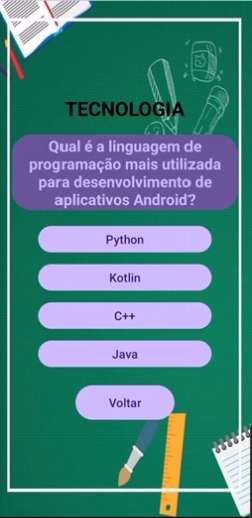
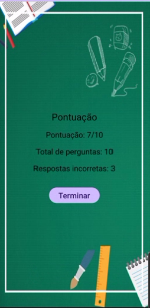

# EDUKA

# Introdução

O presente relatório visa apresentar o processo de desenvolvimento do aplicativo Android EDUKA. Trata-se de um aplicativo educativo cujo objetivo principal é proporcionar uma experiência de aprendizado interativo por meio de perguntas nas áreas de Português, Matemática, Ciências e Tecnologia.

## Justificativa

O desenvolvimento do aplicativo EDUKA surge da necessidade de oferecer um aplicativo educativo que promova uma experiência de aprendizado interativo e estimulante para estudantes iniciantes. Com o avanço da tecnologia e o crescente uso de dispositivos móveis, devemos explorar novas formas de ensino que se adequam às preferências dos utilizadores.

## Objetivos

### Geral

Desenvolver um aplicativo educativo de fácil uso, capaz de ajudar estudantes iniciantes em seu processo de aprendizagem.

### Específicos

* Proporcionar uma experiência de aprendizado interativo e personalizado por meio de perguntas e respostas nas áreas de Português, Matemática, Ciências e Tecnologia.
* Oferecer feedback imediato sobre o desempenho do utilizador, permitindo a identificação de áreas de melhoria e o acompanhamento do progresso individual.
* Incentivar o desenvolvimento de habilidades, como interpretação textual, cálculo matemático e conhecimento científico.

## Requisitos Funcionais

* **Identificação do utilizador:** Permitir a entrada personalizada para cada utilizador do aplicativo.
* **Perguntas em Diversas Áreas:** Disponibilização de perguntas nas áreas de Português, Matemática, Ciências e Tecnologia, abrangendo diferentes níveis de dificuldade e temas relevantes.
* **Feedback Instantâneo:** Feedback imediato sobre as respostas fornecidas pelo utilizador, indicando se estão corretas ou incorretas.
* **Personalização do Estudo:** Possibilidade de personalizar de acordo com as preferências e necessidades individuais, selecionando áreas específicas de interesse.
* **Estatísticas de Desempenho:** Registro do desempenho do utilizador, com dados sobre acertos, erros e progresso geral.
* **Recursos Visuais e Multimídia:** Integração de recursos visuais, como imagens e vídeos, para complementar o conteúdo educativo e tornar a experiência de aprendizagem mais rica e dinâmica.

## Requisitos Não Funcionais

* **Usabilidade:** O aplicativo deve ser intuitivo e fácil de usar.
* **Desempenho:** O aplicativo deve ser responsivo e ter tempos de carregamento rápidos, dando uma experiência fluida e sem interrupções.
* **Compatibilidade:** O aplicativo deve ser compatível com uma ampla variedade de dispositivos móveis Android, garantindo que possa ser acessado por um grande número de utilizadores.
* **Confiabilidade:** O aplicativo deve ser estável e confiável, minimizando ocorrências de falhas e erros durante o uso.

## Tecnologia utilizadas

* **Plataforma Android:** Desenvolvimento nativo para dispositivos móveis Android, visando alcançar uma ampla base de utilizadores e garantir compatibilidade com uma variedade de dispositivos.
* **Java:** Linguagem de programação utilizada para implementação da lógica e interface do aplicativo, garantindo desempenho e flexibilidade no desenvolvimento.
* **Android Studio:** Ambiente de desenvolvimento integrado (IDE) utilizado para criação, depuração e testes do aplicativo Android, proporcionando uma experiência de desenvolvimento eficiente e produtiva.
## Desenvolvimento do aplicativo

### Design de Interface do Utilizador (UI) e Experiência do Utilizador (UX)

* **Tela Inicial:**
* 
  

    * Permite que os Utilizadores insiram seus nomes e cliquem no botão "ENTRAR" para acessar o aplicativo.
    * Utiliza elementos como `LinearLayout`, `TextView` e `Button` para definir a estrutura visual.

* **Tela Principal:**
* 
   

    * Este layout proporciona uma interface de utilizador fácil de usar para os utilizadores do aplicativo Eduka, permitindo que eles escolham entre diferentes categorias de perguntas ou voltem à tela anterior.
    * Utiliza elementos como `LinearLayout`, `TextView` e `Button` para definir a estrutura visual.
    * Cada botão possui um ID único, um texto que descreve a categoria e um método de callback que será chamado quando o botão for clicado.

* **Telas temáticas:**
* 
     
  
    * Apresentam perguntas e respostas relacionadas a cada tema específico.
    * Utilizam elementos como `LinearLayout`, `TextView`, `RadioButton` e `ImageView` para definir a estrutura visual.

* **Tela Pontuação:**
* 
  

    * Mostra o desempenho do usuário em cada tema, com informações sobre acertos, erros e tempo gasto.
    * Utiliza elementos como `LinearLayout`, `TextView
